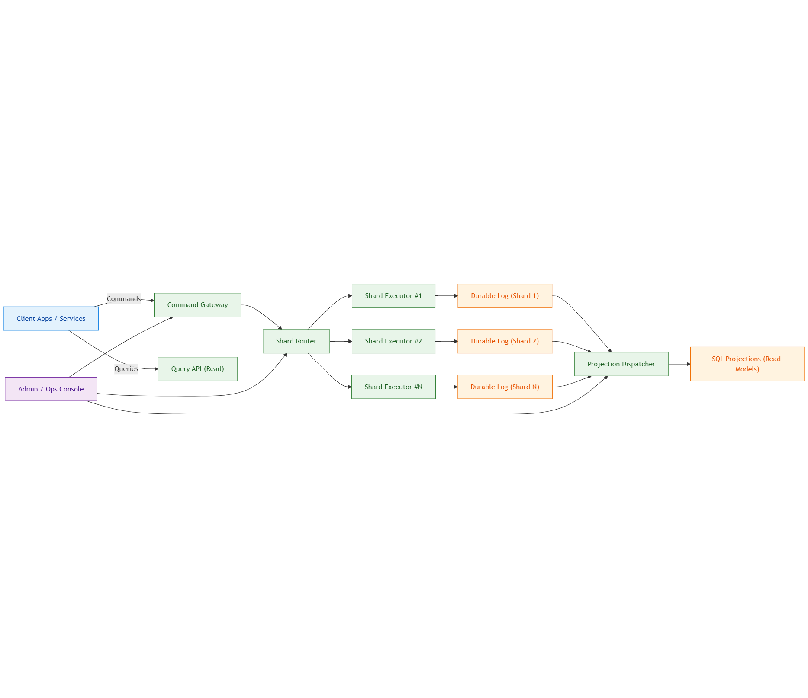
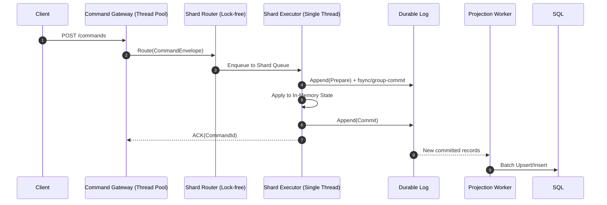
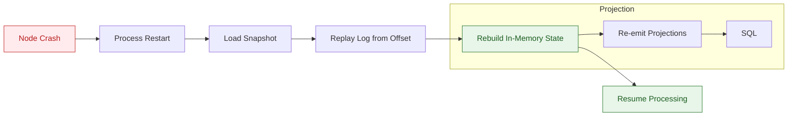
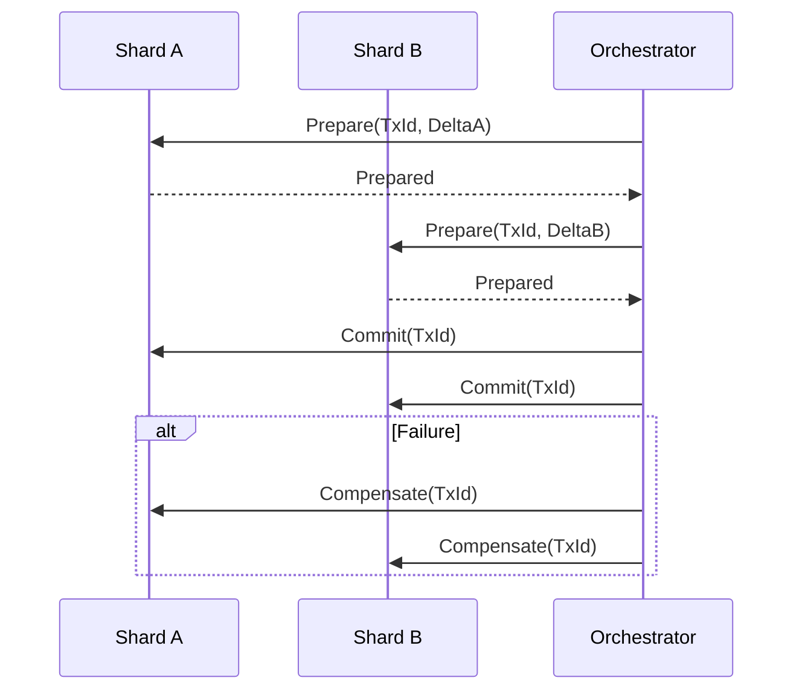
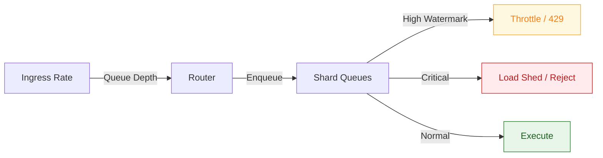

# TOGAF Phase C — Application Architecture (Engine-Level)

> Folder: `ea/`  
> Format: **Markdown only (single continuous block)**  
> Diagrams: **Mermaid (renderable, color-styled)**  
> Purpose: Define the concrete, implementable application architecture for the Ultra-Fast OLTP Engine, strictly conforming to the locked Data Architecture. This is runtime-accurate: components, threading, data flow, ACID execution, failure handling, extensibility, and operability.

---

## A-A.1 Architectural Objectives
- **Deterministic execution:** Single-writer per shard, no locks in the hot path  
- **Engine-level ACID:** Protocol/log-based transactions, SQL never authoritative  
- **Memory-first, log-first:** In-memory execution with durable append before ACK  
- **Horizontal scale:** Shards as independent execution units  
- **Observability & Ops:** First-class metrics, tracing, and admin controls  
- **Extensibility without risk:** Pluggable state layouts, codecs, and projections under strict invariants  

---

## A-A.2 System Context (C4-Level)

[Mermaid Syntax](images/system-context-c4.md)

---
A-A.3 Container Decomposition
```mermaid
flowchart TB
  classDef core fill:#e8f5e9,stroke:#2e7d32,color:#1b5e20;
  classDef io fill:#e3f2fd,stroke:#1e88e5,color:#0d47a1;
  classDef data fill:#fff3e0,stroke:#ef6c00,color:#e65100;
  classDef ops fill:#f3e5f5,stroke:#6a1b9a,color:#4a148c;

  subgraph Edge["Edge / API Layer"]:::io
    Gateway["Command Gateway"]
    QueryAPI["Query API"]
  end

  subgraph Core["Execution Core"]:::core
    Router["Shard Router"]
    ShardExec["Shard Executor(s)"]
    TxMgr["Transaction Protocol"]
    MemArena["Memory Arenas"]
  end

  subgraph Durability["Durability & Recovery"]:::data
    LogWriter["Durable Log Writer"]
    SnapshotMgr["Snapshot Manager"]
    Replay["Replay Engine"]
  end

  subgraph ReadSide["Read / Projection"]:::data
    Projector["Projection Dispatcher"]
    SQL["SQL Databases"]
  end

  subgraph Ops["Observability & Admin"]:::ops
    Metrics["Metrics / Tracing"]
    Admin["Admin API"]
  end

  Gateway --> Router
  Router --> ShardExec
  ShardExec --> TxMgr
  TxMgr --> LogWriter
  ShardExec --> MemArena
  LogWriter --> SnapshotMgr
  LogWriter --> Replay
  LogWriter --> Projector
  Projector --> SQL
  Admin --> Gateway
  Admin --> Router
  Admin --> Projector
  Metrics --- Gateway
  Metrics --- ShardExec
  Metrics --- Projector
```
---
A-A.4 Runtime Execution Model (Threads & Queues)


Threading Rules

Gateway/Router: Multi-threaded, lock-free enqueue

Shard Executor: Single dedicated thread per shard (no locks)

Projection Workers: Background pool, idempotent, offset-based

A-A.5 Core Components & Responsibilities
1) Command Gateway

AuthN/Z, schema validation, idempotency extraction

Produces CommandEnvelope and forwards to Router

Never mutates state

2) Shard Router

Computes ShardId = Hash(ShardKey)

Enqueues to shard-local SPSC/MPSC ring buffers

3) Shard Executor (Core Engine)

Owns shard state and memory arena

Executes sequentially

Enforces ACID via protocol (Prepare/Commit/Compensate)

Hot path: no allocations, no locks

4) Transaction Protocol (Engine-Level ACID)

Atomicity: Prepare → Apply → Commit (or Compensate)

Consistency: Domain invariants inside state machine

Isolation: Single-writer per shard

Durability: Append before ACK (fsync/replicated)

5) Durable Log Writer

Append-only segmented files

Group-commit, CRC, optional encryption

Replication hooks (leader/follower)

6) Snapshot Manager & Replay Engine

Periodic snapshots bound to log offsets

Deterministic recovery: Snapshot + Replay

7) Projection Dispatcher

Reads committed offsets

Transforms to read models

Batches to SQL, monotonic offsets

8) Query API

Serves reads from SQL projections

Never touches execution state

9) Observability & Admin

Metrics, tracing, health, backpressure, rebalancing

Ops: pause shard, force snapshot, rebuild projections

A-A.6 Hot Path (Pseudo-Flow)
```scss
Dequeue(CommandEnvelope)
  -> TxProtocol.Prepare()
  -> LogWriter.Append(Prepare)
  -> StateMachine.Apply()
  -> LogWriter.Append(Commit)
  -> ACK
```

Guarantees

Exactly-once within shard via (TxId, Offset)

Idempotent replays

Zero allocations on hot path (arena + pooling)

A-A.7 Failure, Recovery & Consistency

Cases

Crash after Prepare, before Commit → Compensate on replay

Crash after Commit, before projection → Projection resumes by offset

Split-brain → Epoch fencing, stale leader rejected

A-A.8 Cross-Shard Transactions (Saga)

Rules
* Idempotent per (TxId, ShardId)
* Exactly-once within each shard
* Deterministic compensation on partial prepares

A-A.9 Backpressure, Flow Control & QoS

*  High/Low watermarks per shard
*  Admission control at Gateway
*  Projection lag does not block execution

A-A.10 Extensibility Points (Safe)
*  State Layouts: Aggregate map, columnar, graph, indexed
*  Codecs: Log/snapshot encoding, compression
*  Projections: Custom mappers, batching strategies
*  Policies: Commit mode, snapshot cadence, retention

Guardrails
*  Deterministic updates only
*  Idempotent handlers
*  Must pass replay, failover, and zero-allocation tests

A-A.11 Security
*  mTLS at Gateway, token-based auth
*  Encryption-at-rest for logs/snapshots (optional)
*  Audit: immutable offsets, correlation IDs
*  Multi-tenancy: tenant-aware routing & storage

A-A.12 Observability
*  Metrics: P50/P99 latency, queue depth, fsync time, replication lag
*  Tracing: CorrelationId across Gateway → Shard → Log → Projection
*  Health: Snapshot age, replay SLA, projection offset skew

A-A.13 Compliance with Data Architecture
*  SQL is read-only projection
*  Recovery uses Snapshot + Log Replay only
*  ACID enforced by protocol + log
*  Tiering, compaction, checksums honored

A-A.14 Deliverables
*  Component & container model
*  Threading & execution pipeline
*  ACID protocol implementation
*  Failure/recovery playbooks
*  Extensibility & ops runbooks

A-A.15 Change Control
*  Conforms to locked Data Architecture
*  Any deviation requires: What, Where, Why, Risk, Rollback + replay validation

---
| Layer              | Kubernetes Mapping                  |
| ------------------ | ----------------------------------- |
| Gateway            | `Deployment` (stateless, autoscale) |
| Shard Router       | `Deployment`                        |
| Shard Executors    | `StatefulSet` (one pod = one shard) |
| Durable Logs       | `PersistentVolume` / local NVMe     |
| Snapshots          | Object storage / PV                 |
| Projection Workers | `Deployment`                        |
| SQL                | Managed DB / VM / on-prem DB        |

| Engine Component     | Azure                   |
| -------------------- | ----------------------- |
| Persistent Log       | Azure Disk / Ultra Disk |
| Snapshots            | Azure Blob Storage      |
| SQL Projections      | Azure SQL / PostgreSQL  |
| Messaging (optional) | Service Bus             |
| Identity             | Entra ID                |

| Engine Component     | AWS                  |
| -------------------- | -------------------- |
| Persistent Log       | EBS io2 / local NVMe |
| Snapshots            | S3                   |
| SQL Projections      | RDS / Aurora         |
| Messaging (optional) | SNS/SQS              |
| Identity             | IAM                  |

| Engine Component | On-Prem                    |
| ---------------- | -------------------------- |
| Persistent Log   | Local SSD / SAN            |
| Snapshots        | NFS / Object Store (MinIO) |
| SQL Projections  | SQL Server / PostgreSQL    |
| Orchestration    | Kubernetes / Nomad         |
| Identity         | LDAP / AD                  |

---
5️⃣ Kubernetes Topology (How It Will Look)
🔷 Control Plane

API Gateway

Shard Router

Projection Dispatcher

Observability

🔷 Data Plane

Shard Executor Pods (StatefulSet)

Each with:

Local durable log volume

Snapshot access

Engine-level replication

6️⃣ Failover & Recovery in Kubernetes
Pod Crash

➡ K8s restarts pod
➡ Engine does: Load Snapshot → Replay Log → Resume

Node Failure

➡ Pod rescheduled on another node
➡ Volume reattached
➡ Replay happens
➡ No data loss

Scale Out

➡ Add more shard pods
➡ Router updates shard map
➡ New shards start serving

