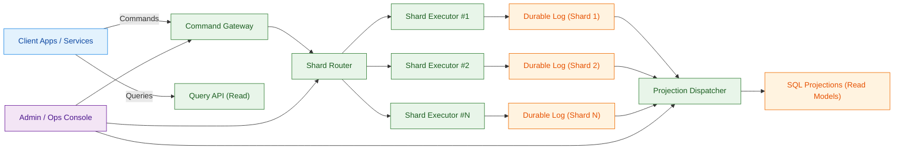

```mermaid
flowchart LR
  classDef client fill:#e3f2fd,stroke:#1e88e5,stroke-width:1px,color:#0d47a1;
  classDef engine fill:#e8f5e9,stroke:#2e7d32,stroke-width:1px,color:#1b5e20;
  classDef data fill:#fff3e0,stroke:#ef6c00,stroke-width:1px,color:#e65100;
  classDef ops fill:#f3e5f5,stroke:#6a1b9a,stroke-width:1px,color:#4a148c;

  ClientApps["Client Apps / Services"]:::client -->|Commands| Gateway["Command Gateway"]:::engine
  ClientApps -->|Queries| QueryAPI["Query API (Read)"]:::engine
  Gateway --> Router["Shard Router"]:::engine
  Router --> Shard1["Shard Executor #1"]:::engine
  Router --> Shard2["Shard Executor #2"]:::engine
  Router --> ShardN["Shard Executor #N"]:::engine

  Shard1 --> Log1["Durable Log (Shard 1)"]:::data
  Shard2 --> Log2["Durable Log (Shard 2)"]:::data
  ShardN --> LogN["Durable Log (Shard N)"]:::data

  Log1 --> Projector["Projection Dispatcher"]:::engine
  Log2 --> Projector
  LogN --> Projector
  Projector --> SQL["SQL Projections (Read Models)"]:::data

  Ops["Admin / Ops Console"]:::ops --> Gateway
  Ops --> Router
  Ops --> Projector
```
