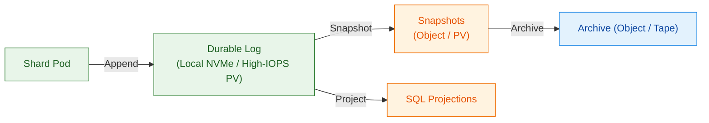
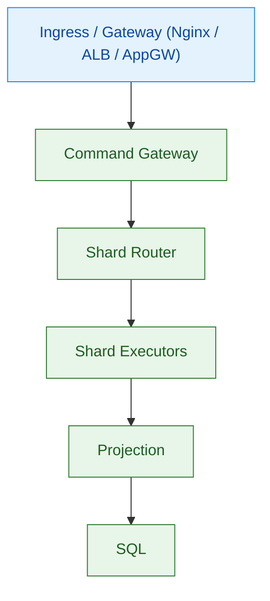
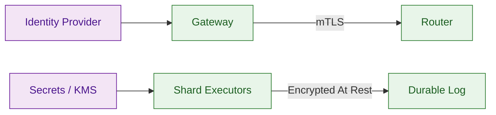
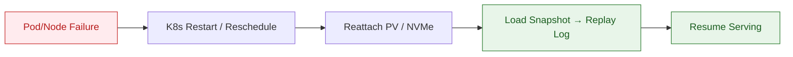
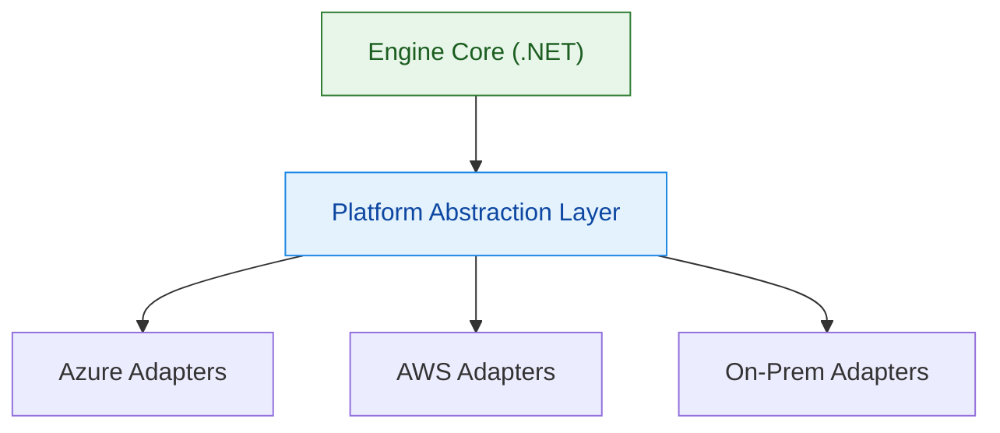
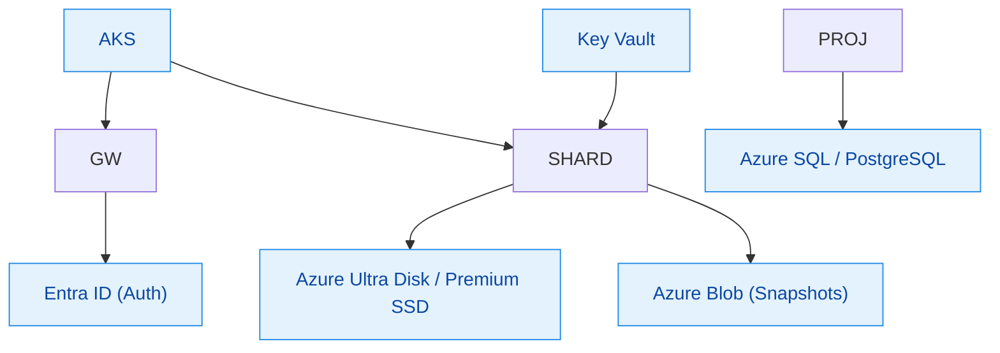
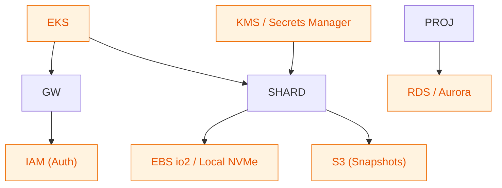
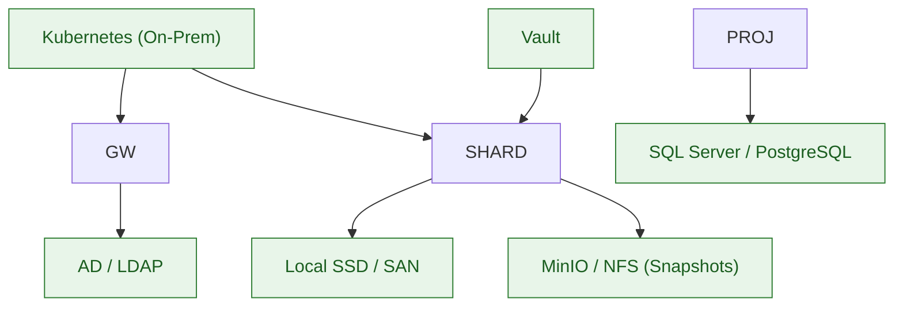

# TOGAF Phase D — Technology Architecture (Kubernetes + Azure + AWS + On-Prem)

> Folder: `ea/`  
> Format: **Markdown only — single continuous block (no breaks)**  
> Diagrams: **Mermaid (renderable, color-styled)**  
> Scope: Cloud-neutral, Kubernetes-native runtime for the Ultra-Fast OLTP Engine with first-class support for **Azure**, **AWS**, and **On-Prem**.  
> Constraint: Must conform to locked Data & Application Architectures (log-first, snapshot+replay, engine-level ACID, SQL as projection only).

---

## D-T.1 Technology Principles
- **Cloud-Neutral Core:** Engine code never calls cloud APIs directly; all I/O via platform adapters.
- **Kubernetes-First:** Scheduling, health, scaling, and networking via K8s primitives.
- **Stateful Where Needed:** Shards run as **StatefulSets** with stable identity and volumes.
- **Performance-Preserving:** Local NVMe where available; high-IOPS network storage otherwise.
- **Security by Default:** mTLS, encryption-at-rest, secret isolation, least privilege.
- **Ops-Ready:** Metrics, tracing, logging, backup/restore, rolling upgrades, disaster recovery.

---

## D-T.2 Reference Deployment Topology (Kubernetes)

```mermaid
flowchart TB
  classDef edge fill:#e3f2fd,stroke:#1e88e5,color:#0d47a1;
  classDef core fill:#e8f5e9,stroke:#2e7d32,color:#1b5e20;
  classDef data fill:#fff3e0,stroke:#ef6c00,color:#e65100;
  classDef ops fill:#f3e5f5,stroke:#6a1b9a,color:#4a148c;

  subgraph K8s["Kubernetes Cluster"]:::core
    subgraph Edge["Edge / API"]:::edge
      GW["Command Gateway (Deployment)"]
      QAPI["Query API (Deployment)"]
    end

    subgraph Core["Execution Core"]:::core
      RTR["Shard Router (Deployment)"]
      SHARD["Shard Executors (StatefulSet)\n1 Pod = 1 Shard\nStable Identity + PVC"]
    end

    subgraph Dur["Durability"]:::data
      LOG["Durable Log (PVC / Local NVMe)"]
      SNAP["Snapshots (Object / PV)"]
      REPL["Replication / Fencing"]
    end

    subgraph Read["Read / Projection"]:::data
      PROJ["Projection Workers (Deployment)"]
      SQL["SQL (Managed / VM / On-Prem)"]
    end

    subgraph Ops["Observability & Admin"]:::ops
      MET["Metrics / Tracing"]
      ADM["Admin / Ops API"]
      BKP["Backup / Restore"]
    end
  end

  GW --> RTR
  QAPI --> SQL
  RTR --> SHARD
  SHARD --> LOG
  LOG --> SNAP
  LOG --> PROJ
  PROJ --> SQL
  ADM --> GW
  ADM --> RTR
  MET --- GW
  MET --- SHARD
  MET --- PROJ
```
K8s Mapping
*  Stateless: Gateway, Router, Projection → Deployment + HPA
*  Stateful: Shards → StatefulSet + PersistentVolumeClaim
*  Storage: Logs on PV/Local NVMe; Snapshots on Object Storage or PV

D-T.3 Storage Architecture (Performance-First)

Rules
*  Hot Path: Local NVMe or ultra-IOPS PV for logs.
*  Warm: SQL for reads; snapshots for recovery.
*  Cold: Archived segments for compliance.

D-T.4 Networking, Ingress & Service Mesh

*  Ingress: TLS termination, rate-limits, WAF.
*  mTLS: Pod-to-pod encryption (Istio/Linkerd optional).
*  Network Policies: Least-privilege east-west traffic.

D-T.5 Security Architecture

*  Auth: OIDC/OAuth2 at Gateway.
*  Secrets: External secret store (Key Vault / KMS / Vault).
*  At-Rest: Disk encryption for logs & snapshots.
*  Audit: Immutable offsets + correlation IDs.

D-T.6 Observability & Operations
```mermaid
flowchart TB
  classDef ops fill:#f3e5f5,stroke:#6a1b9a,color:#4a148c;
  classDef app fill:#e8f5e9,stroke:#2e7d32,color:#1b5e20;

  SHARD["Shard Executors"]:::app --> MET["Prometheus / OpenTelemetry"]:::ops
  GW["Gateway"]:::app --> MET
  PROJ["Projection"]:::app --> MET
  MET --> GRAF["Grafana / Dashboards"]:::ops
  LOGS["Central Logs"]:::ops <-- SHARD
  ALERT["Alerting"]:::ops <-- MET
```
*  Metrics: P50/P99 latency, queue depth, fsync time, replication lag.
*  Tracing: CorrelationId end-to-end.
*  Runbooks: Snapshot age, replay SLA, projection lag.

D-T.7 Resilience, Failover & DR

*  Zonal HA: Shards spread across zones; logs replicated.
*  Node Loss: Pod rescheduled; volume reattached; deterministic replay.
*  DR: Snapshot copy to secondary region; restore + replay.

D-T.8 Platform Abstraction Layer (Cloud-Neutral)

Interfaces

IBlockStorage, IObjectStore, ISecrets, IIdentity, IMetrics, IIngress
Result: One codebase; multiple providers.
---
D-T.9 Azure Reference

*  Compute: AKS
*  Logs: Ultra Disk / Premium SSD
*  Snapshots: Blob
*  DB: Azure SQL / PostgreSQL
*  Secrets: Key Vault
*  Identity: Entra ID

D-T.10 AWS Reference

*  Compute: EKS
*  Logs: EBS io2 / instance NVMe
*  Snapshots: S3
*  DB: RDS/Aurora
*  Secrets: KMS/Secrets Manager
*  Identity: IAM

D-T.11 On-Prem Reference

*  Compute: Kubernetes / OpenShift
*  Logs: Local SSD / SAN
*  Snapshots: MinIO / NFS
*  DB: SQL Server / PostgreSQL
*  Secrets: Vault
*  Identity: AD/LDAP

---

D-T.12 Scaling, Rebalancing & Upgrades
*  Scale Out: Add shard StatefulSet replicas; Router updates map.
*  Rebalance: Drain shard → snapshot → attach volume to new node → replay.
*  Rolling Upgrade: Canary gateway, then projections, then shard-by-shard with replay validation.

D-T.13 Compliance with Prior Architectures
*  Data: Log is source of truth; recovery = snapshot + replay; SQL is projection.
*  Application: Single-writer shards; engine-level ACID; idempotent projections.

D-T.14 Technology Deliverables
*  Kubernetes manifests (Deployments, StatefulSets, PVCs, StorageClasses)
*  Platform adapters (Azure/AWS/On-Prem)
*  Security model (mTLS, secrets, IAM/OIDC)
*  Observability stack (metrics, tracing, logging)
*  DR runbooks and upgrade playbooks

D-T.15 Change Control
*  Must not violate locked Data/Application rules.
*  Any change requires: What, Where, Why, Risk, Rollback + replay validation.
  
